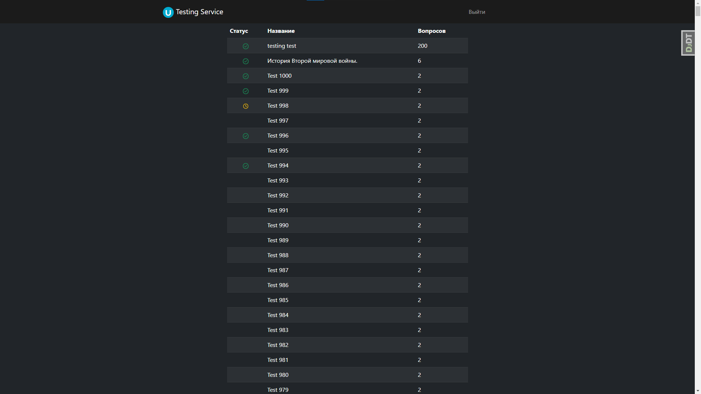
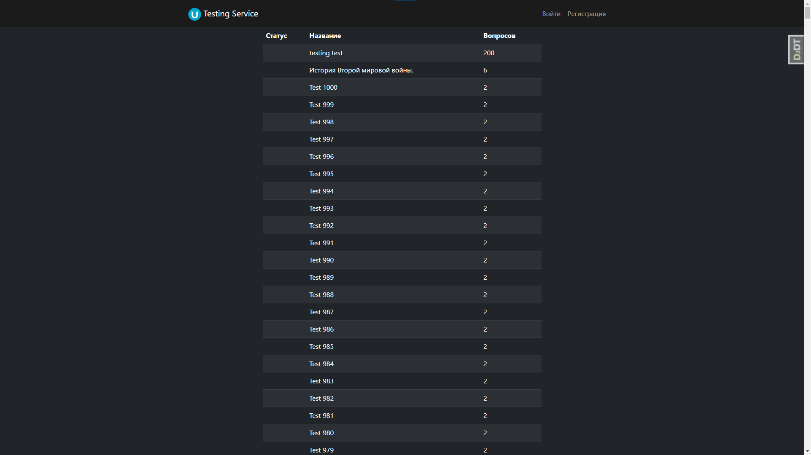
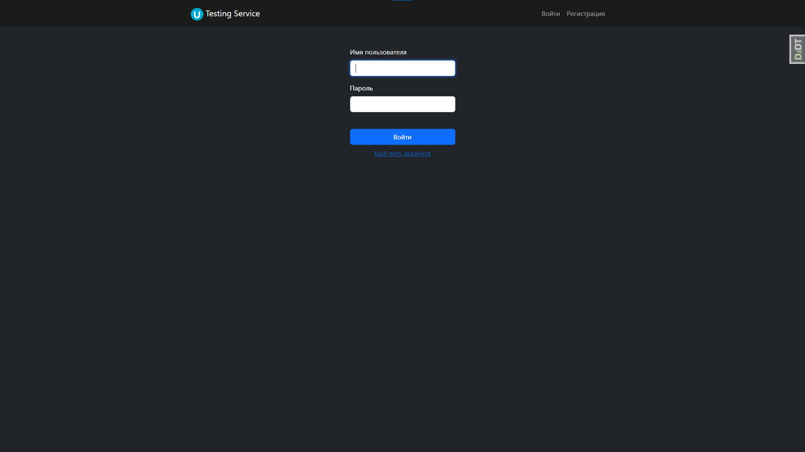
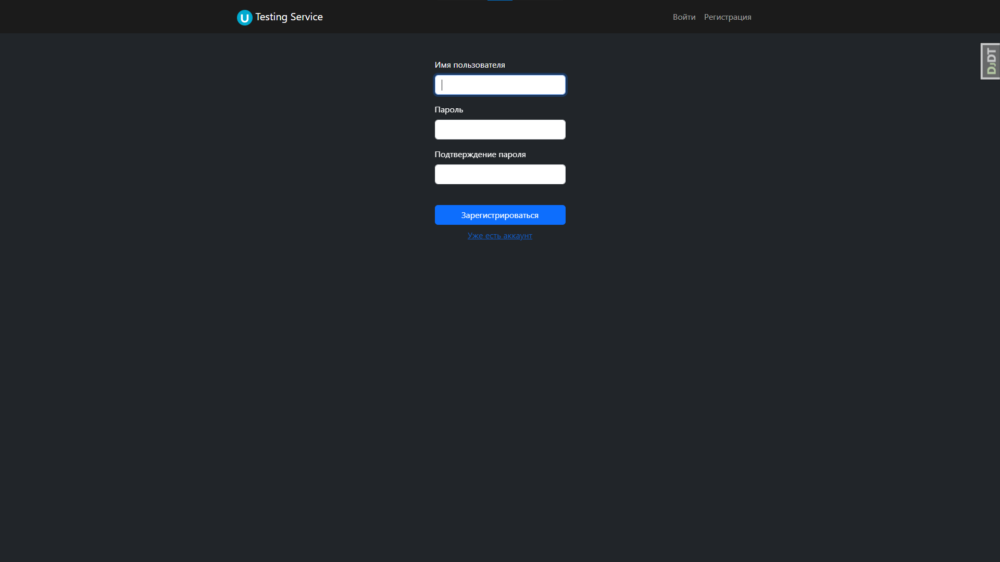
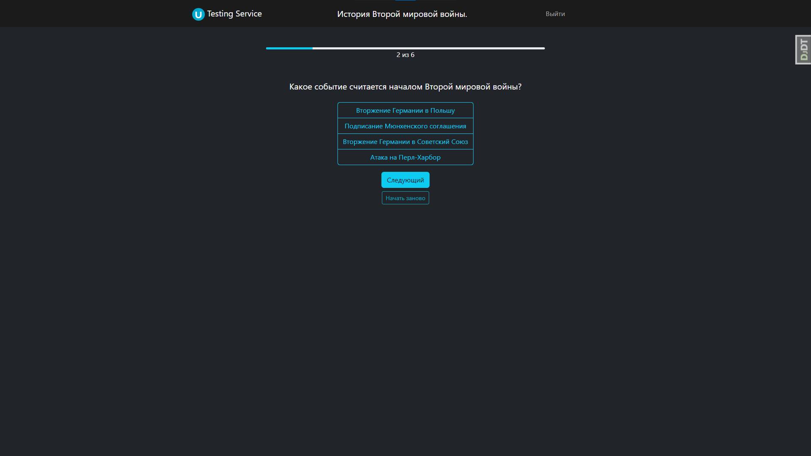
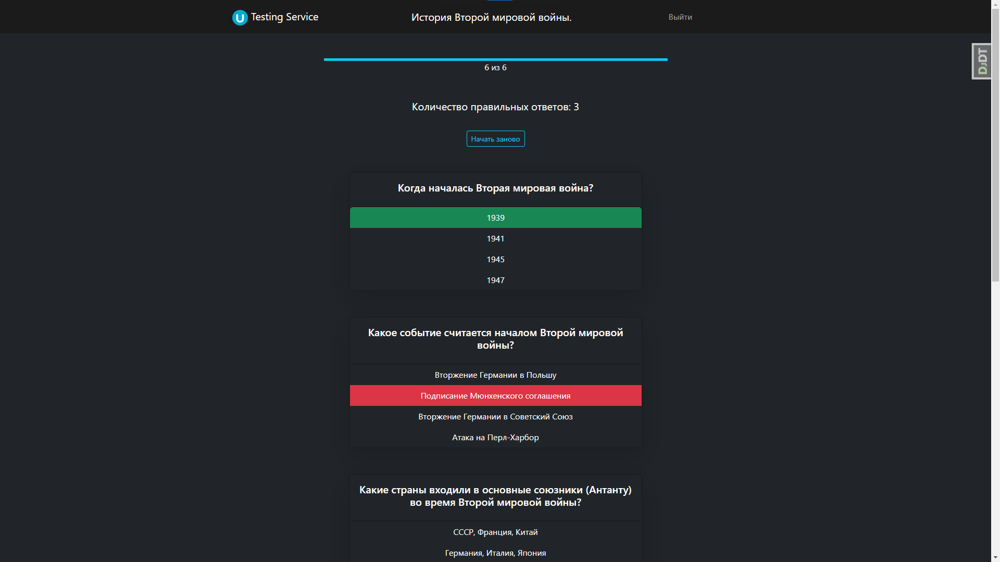
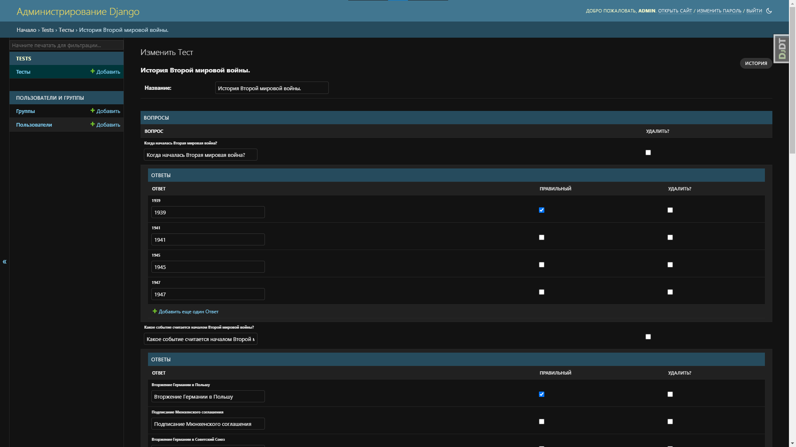

# TestingService

<p align="center">

</p>

Пет проект доведённый до конца, будет ещё конечно дополняться новыми возможностями когда будет свободное время

___

### Установка

1. `git clone https://github.com/h1lton/TestingService.git`
2. `cd TestingService`
3. `py -m venv venv`
4. `venv\Scripts\activate`
5. `pip install -r requirements.txt`
6. `py manage.py runserver`

Все готово, открывайте.

___

### Главная страница:

<p align="center"></p>

Основной функционал — это вывод всех тестов с кол-вом вопросов
и статусом(если начали решать жёлтые часики, если решили то, зелёная галочка)

Если вы не авторизованы она будет выглядеть данным образом:
<p align="center">

</p>

Если вы попытаетесь перейти на тест вас перебросит на страницу входа в аккаунт, после аутентификации
вас перекинет на тест.

___

### Вход и регистрация:

<p align="center">


</p>

___

### Тест:

Представление устроено так:

+ Вы полностью не можете с ним взаимодействовать если вы не авторизованы.
+ Каждый вопрос выводится по одному
+ Вы не можете перескакивать через них, так же оставлять не отвеченными.
+ Если вы ответили хотя-бы на 1 вопрос у вас есть возможность начать с начала.
+ Если вы ответили на все вопросы вам будет выводиться результаты, так же можно будет начать с начала.

### Вопрос:

<p align="center">

</p>

### Результаты:

<p align="center">

</p>

___

### Создание тестов

С помощью админ панели:
<p align="center">

</p>
Используется:

+ Валидация:
    + То что должен быть хотя-бы 1 вопрос.
    + На то что должен быть хотя-бы 1 правильный и неправильный ответ.
+ django-nested-admin он делает вложенный Inline в Inline.

С помощью shell:

`py manage.py shell`

```python
from terminal_assistant import *
```

Этот файл очень помогает в работе с бд, все импорты и функции можете посмотреть в самом файле, я все их продукоментировал.

___

### Дальнейшая жизнь проекта:

Разумеется я буду его допиливать дальше, вот что в планах:

+ Сделать так что бы мог создавать любой пользователь тесты, т.е. отказаться от админки,
т.к. сейчас это выглядит так что обычному обувателю не понятно, та и просто что бы любой мог создавать тесты.
+ Переделать немного форнтенд, но форнтенд всегда на последнем плане, функционал приоритетнее.
+ Хочу ещё сделать тесты от AI, думаю трендовая тема, можно попробовать.